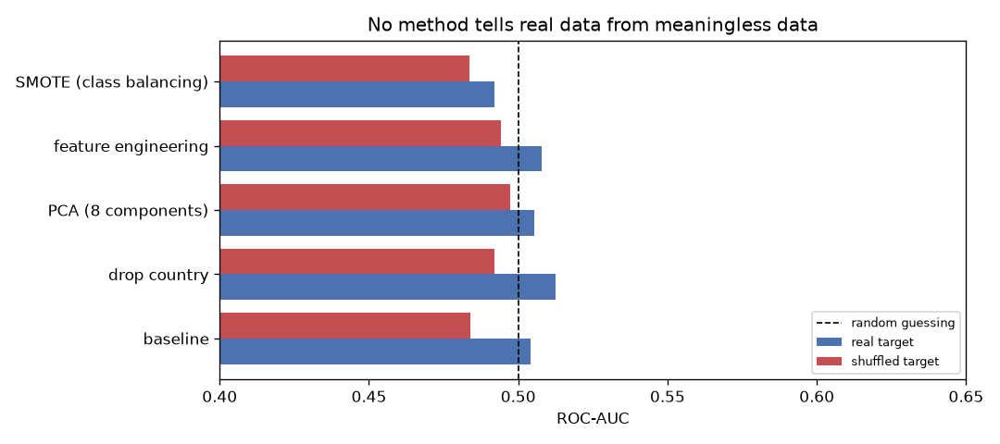
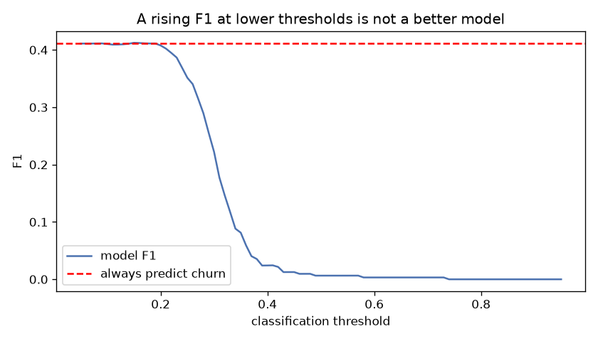
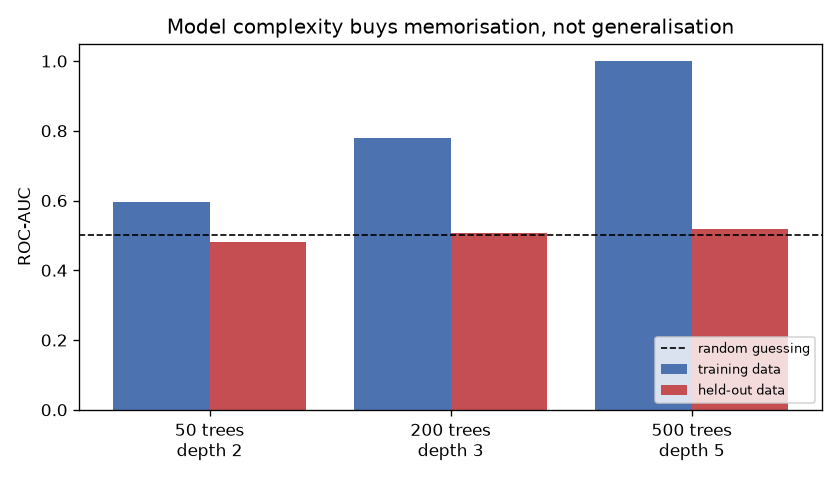

> **Язык:** [English](README.md) | Русский

# Spotify Churn Analysis

Проект по предсказанию оттока, который заканчивается отрицательным результатом — и набором
экспериментов, показывающих, что этот результат верен, а не следствие плохой модели.

## Кратко

В датасете нет связи между признаками и меткой оттока. Кросс-валидированный ROC-AUC
держится на уровне **0.50** для всех моделей и всех способов предобработки, а это
результат случайного угадывания.

Первая модель градиентного бустинга дала F1 = 0.193, и напрашивающийся следующий шаг —
тюнинг: сбалансировать классы, сконструировать признаки, применить PCA. Вместо того чтобы
принять на веру, что виновата модель, репозиторий проверяет это предположение напрямую —
пятью экспериментами: контрольной проверкой пайплайна на данных с заведомым сигналом,
сравнением реальной разметки с намеренно уничтоженной, разбором того, что балансировка
классов делает с метриками, калибровкой оценщика взаимной информации и демонстрацией
переобучения. Все пять сходятся к одному: в данных нет ничего, на чём можно строить
предсказание, поэтому никакая предобработка не поможет.

Ценность проекта в методологии. Он показывает, как отличить ситуацию *«модель нужно
доработать»* от ситуации *«в данных ничего нет»* до того, как силы уйдут не на ту задачу.

## Данные

[Spotify User Behavior for Churn Analysis](https://www.kaggle.com/datasets/nabihazahid/spotify-dataset-for-churn-analysis/data) (Kaggle) — 8 000 пользователей, 12 колонок.

| Группа | Колонки |
|---|---|
| Демография | `gender`, `age`, `country` |
| Подписка | `subscription_type` |
| Поведение при прослушивании | `listening_time`, `songs_played_per_day`, `skip_rate`, `ads_listened_per_week`, `offline_listening` |
| Технические данные | `device_type` |
| Целевая переменная | `is_churned` (1 — ушёл, 0 — остался) |

Доля оттока 25.89%, соотношение классов примерно 2.9 : 1 — умеренный дисбаланс, с которым
модели справляются штатно.

## Структура репозитория

```
├── data/
│   └── spotify_churn_dataset.csv
├── reports/
│   └── figures/                 создаётся скриптом
├── src/
│   └── experiments.py           все пять экспериментов
├── requirements.txt
└── README.md
```

## Запуск

```bash
python -m venv .venv
source .venv/bin/activate          # Windows: .venv\Scripts\activate
pip install -r requirements.txt
python src/experiments.py
```

Прогон занимает около двух минут. Все таблицы ниже выводятся в консоль, графики
сохраняются в `reports/figures/`.

## Ключевые понятия

Три термина используются во всех экспериментах, поэтому вводятся один раз здесь.

**Балл модели.** Классификатор не выдаёт готовый ответ «ушёл / остался». Метод
`predict_proba` возвращает каждому пользователю число от 0 до 1 — оценку правдоподобия
оттока. Чтобы превратить баллы в ответы, нужен **порог**: правило вида «все, у кого балл
выше 0.5, считаются ушедшими». Значение порога выбирается произвольно, и от него зависят
все пороговые метрики.

**ROC-AUC.** Метрика качества ранжирования, не зависящая от порога. Определение буквальное:
это доля пар «ушедший + оставшийся», в которых ушедший получил от модели балл выше. Значение
1.0 означает, что всякий ушедший стоит выше всякого оставшегося; значение **0.5 — что
порядок баллов случаен и модель эквивалентна подбрасыванию монеты**. Благодаря независимости
от порога ROC-AUC показывает, различает ли модель классы в принципе, и именно поэтому служит
основной метрикой диагностики.

**Отложенная выборка.** Данные делятся на обучающую часть и тестовую; модель настраивается
на первой, а качество измеряется исключительно на второй, которую модель не видела. В
экспериментах используется либо разбиение 70/30, либо кросс-валидация — пятикратное
повторение той же схемы со сменой отложенной части и усреднением результата. Зачем это
обязательно, наглядно показывает эксперимент 5.

## Методика

Каждый эксперимент отвечает на один вопрос, и они опираются друг на друга. Структура секций
единая: что проверяется, каким способом, результат, вывод.

### 1. Исправен ли пайплайн?

**Что проверяется.** Прежде чем делать вывод об отсутствии сигнала, нужно исключить ошибку
в коде: сломанная кросс-валидация или неверно посчитанная метрика тоже дадут 0.50 на любых
данных. Снаружи эти две ситуации неотличимы, поэтому инструмент проверяется отдельно — на
данных, где сигнал заведомо есть.

**Как.** В копию данных добавляется искусственная колонка `таргет + случайный шум` — по
построению связанная с ответом. Разрыв между классами в этой колонке всегда равен 1.0
(ушедшим прибавляется единица, оставшимся ноль), а разброс шума задаётся вручную. Отношение
разрыва к разбросу и есть сила сигнала: при разбросе 0.8 классы почти разделены, при 6.0 —
перемешаны почти полностью. Обучение и оценка идут тем же кодом, что и во всех остальных
экспериментах.

**Результат.**

| Сила искусственного сигнала (разброс шума) | ROC-AUC |
|---|---|
| очень слабый (6.0) | 0.5155 |
| слабый (3.0) | 0.5750 |
| умеренный (1.5) | 0.6569 |
| сильный (0.8) | 0.8097 |

**Вывод.** Метрика растёт монотонно с силой сигнала и реагирует даже на очень слабый — тот,
где шум в шесть раз перекрывает разрыв между классами. Пайплайн исправен и чувствителен;
нулевые результаты в следующих экспериментах описывают данные, а не баг.

### 2. Реальный таргет против перемешанного

**Что проверяется.** Извлекает ли хоть один из запланированных методов улучшения — удаление
`country`, PCA, feature engineering, балансировка — хоть что-то из данных.

**Как.** Перемешивание `is_churned` между строками уничтожает любую связь по построению:
метка достаётся случайному пользователю. Каждый метод прогоняется дважды — на настоящей
разметке и на перемешанной. Перемешанный вариант играет роль контрольной группы: если метод
показывает на нём тот же результат, что и на настоящем, он не извлекает ничего.

**Результат.**

| Метод | ROC-AUC (Реальный таргет) | ROC-AUC (Перемешанный таргет) |
|---|---|---|
| базовая модель | 0.5040 | 0.4839 |
| убрать `country` | 0.5125 | 0.4920 |
| PCA (8 компонент) | 0.5055 | 0.4973 |
| feature engineering (+7 признаков) | 0.5078 | 0.4942 |
| SMOTE (баланс классов) | 0.4921 | 0.4837 |



**Вывод.** Колонки неотличимы: данные ведут себя так же, как данные с намеренно
уничтоженной разметкой. Показателен случай `country`: его удаление подняло ROC-AUC на
0.009, но на *перемешанном* варианте тот же приём дал прирост 0.008. Это шум
кросс-валидации, а не находка. Именно так, перебирая варианты и оставляя лучший, проект
убеждает себя в результате, которого нет.

### 3. Что на самом деле делает балансировка классов

**Что проверяется.** Исходная модель имела F1 = 0.193, и план улучшений предполагал поднять
его балансировкой классов. Проверяется, улучшает ли балансировка модель — или только
перемещает точку на шкале компромисса.

Здесь нужны три пороговые метрики. **Precision** — доля действительно ушедших среди тех,
кого модель пометила как ушедших. **Recall** — доля пойманных моделью среди всех настоящих
ушедших. **F1** — их среднее гармоническое, сворачивающее обе величины в одно число. Все
три зависят от порога: изменение правила отсечения меняет их без какого-либо изменения
модели.

**Как.** Одна и та же модель оценивается пятью способами: как есть (порог 0.5), после
балансировки SMOTE, с порогами 0.30 и 0.20, и рядом ставится константный предсказатель
«все ушли» — нижняя планка, которую обязана превзойти любая полезная модель. ROC-AUC
приводится в каждой строке как контроль: если модель реально улучшилась, он вырастет; если
меняется только порог, он останется на месте.

**Результат.**

| Вариант | AUC | Precision | Recall | F1 |
|---|---|---|---|---|
| без балансировки | 0.5056 | 0.5000 | 0.0032 | 0.0064 |
| SMOTE | 0.4964 | 0.1864 | 0.0177 | 0.0324 |
| порог 0.30 | 0.5056 | 0.2585 | 0.1948 | 0.2222 |
| порог 0.20 | 0.5056 | 0.2625 | 0.9130 | 0.4078 |
| константа «все ушли» | 0.5000 | 0.2587 | 1.0000 | 0.4111 |



**Вывод.** Снижением одного лишь порога F1 поднимается с 0.006 до 0.408 — выглядит как
впечатляющий прогресс, пока не прочитана последняя строка: константа даёт 0.411 и всё равно
выигрывает. AUC при этом не сдвигается ни в одной строке, то есть сама модель не улучшилась
ни разу.

Precision не уходит от 0.26 — а это в точности доля оттока во всей выборке, её базовая
частота. Если модель не умеет различать классы, любая отобранная ею группа содержит
ушедших в той же пропорции, что и выборка целиком; отбор наугад дал бы тот же результат.
Работающая модель тем и отличается, что её выборка обогащена ушедшими и precision заметно
выше базовой частоты.

Первая строка заслуживает отдельного взгляда: precision 0.50 звучит прилично, пока рядом не
поставлен recall — модель пометила семь пользователей из 2400 и угадала в трёх случаях. Ни
одна метрика поодиночке не заслуживает доверия.

### 4. Feature engineering и уровень шума

**Что проверяется.** Feature engineering — создание новых колонок из существующих:
`songs_per_minute = songs_played_per_day / listening_time` и подобные. Вопрос в том, может
ли такая колонка содержать информацию об оттоке, которой не было в исходных.

Теория отвечает: не может. Производный признак вычисляется из исходных, значит, зная
исходные, всегда можно получить производный — и ничего нового он не сообщает. Формально это
неравенство обработки данных: `I(f(X); Y) ≤ I(X; Y)`. На практике feature engineering всё
же помогает, но иначе: он подаёт уже имеющуюся информацию в форме, удобной конкретной
модели. Создать информацию он не может. Эксперимент проверяет, согласуется ли датасет с
этим ожиданием.

**Как.** Мерой служит взаимная информация (mutual information, MI) — насколько знание
признака уточняет знание о таргете. Ноль означает полную независимость: значение признака
не меняет оценку вероятности оттока ни на сколько; чем больше значение, тем сильнее связь.

Производные признаки построены пятью типичными для churn-задач способами: интенсивность
`songs_per_minute`, взаимодействие `skip_x_songs`, вовлечённость `engagement`, нелинейные
преобразования `time_squared` и `log_songs`. В их формулах участвуют ровно три колонки —
`listening_time`, `songs_played_per_day`, `skip_rate`. Неравенство сравнивает `f(X)` с тем
самым `X`, из которого `f` вычислена, поэтому в качестве исходных берутся именно эти три
колонки, а не все двадцать: добавление `age` или `country`, которых нет в формулах, сделало
бы сравнение несравнимым. Оно замкнутое — информация в колонках-источниках против информации
в том, что из них сделали.

**Результат.**

```
Сумма MI, 3 исходных признака:   0.00000
Сумма MI, 5 производных:         0.01544
```

Производные показывают больше исходных — то есть ровно то, чего теорема не допускает.

Прежде чем толковать эту разницу, нужно узнать, различает ли метод такие мелкие величины
вообще. Для этого требуются данные, где правильный ответ известен заранее, и строятся они
тем же приёмом, что в эксперименте 2: перемешиванием таргета. После перемешивания истинная
MI равна ровно нулю, и всё, что оценщик выдаст сверх нуля, — чистая погрешность. Замер
делается на **тех же самых пяти производных признаках**: каждый признак вносит собственную
ошибку, сумма по пяти шумит сильнее суммы по трём, поэтому калибровать нужно ровно ту
конфигурацию, которая дала подозрительное число. Прогонов восемь — по единственному
значению разброс не увидеть, а само число непринципиально, пять или пятнадцать дали бы ту
же картину.

```
8 прогонов: [0.00733 0.00054 0.00136 0.00921 0.02183 0.00890 0.00660 0.01458]
среднее 0.00879, максимум 0.02183
```

**Вывод.** На данных, заведомо не содержащих информации, оценщик выдаёт значения вплоть до
0.022: он считает по конечной выборке и случайные совпадения принимает за связь. Наблюдаемые
0.01544 попадают внутрь этого разброса, то есть отличить их от нуля измерением невозможно.
Производные признаки не добавили информации, а разница между 0.00000 и 0.01544 целиком
объясняется погрешностью метода.

Отсюда общее правило: маленькое положительное число ничего не доказывает, пока не
сопоставлено с шумом самого измерения.

### 5. Модель обучается — но заучивает шум

**Что проверяется.** Может показаться, что нулевые метрики означают «обучение не
происходит». Это не так: обучение идёт, и весьма успешно. Эксперимент показывает, что
именно модель выучивает и почему это видно только на отложенной выборке.

**Как.** Модели нарастающей сложности обучаются на 70% данных, после чего каждая
оценивается дважды: на тех же 70%, которые она видела, и на отложенных 30%, которых не
видела.

**Результат.**

| Деревьев | Глубина | AUC (обучение) | AUC (отложенная) |
|---|---|---|---|
| 50 | 2 | 0.5956 | 0.4810 |
| 200 | 3 | 0.7793 | 0.5059 |
| 500 | 5 | 0.9995 | 0.5190 |



**Вывод.** На 500 деревьях модель почти идеально разделяет обучающую выборку: ёмкости
хватает, чтобы запомнить отдельные строки. Правила вида *«пользователь с age 34,
listening_time 187 и skip_rate 0.22 ушёл»* верны ровно для одной строки и бесполезны для
всех остальных, потому что за ними не стоит закономерность. На отложенной выборке результат
остаётся на уровне монеты.

Показательна как раз самая слабая конфигурация: 50 деревьев глубины 2 не могут ничего
запомнить, поэтому их результат на обучении, 0.5956, честно отражает отсутствие структуры.
Чем больше у модели ёмкость, тем убедительнее она вводит в заблуждение на обучающей
выборке — и тем важнее отложенная. Оценка на обучающих данных представила бы этот датасет
как полный успех.

## Выводы

Пять независимых линий доказательств сходятся:

- ROC-AUC 0.50 на двух семействах моделей и при всех способах предобработки
- результаты на настоящей разметке совпадают с результатами на намеренно уничтоженной
- взаимная информация неотличима от собственного шума оценщика
- precision закреплён на уровне базовой частоты независимо от балансировки
- настроенная модель проигрывает константному предсказателю 0.007 по F1

Признаки не несут информации о целевой переменной. Равномерные, лишённые структуры
распределения числовых колонок указывают на то, что датасет синтетический, а метки
проставлены независимо от поведения пользователей.

Практический вывод — привычка: до начала любого тюнинга прогнать простую модель на
метрике, не зависящей от порога. ROC-AUC около 0.50 означает, что потолок уже достигнут, и
дальнейший перебор гиперпараметров будет подгонкой под шум валидации.

## Оговорки и ограничения

- Воспроизведено на Python 3.14 с pandas 3.0.5, scikit-learn 1.9.0 и matplotlib 3.11.1.
- Отсутствие сигнала показано эмпирически, а не доказано. Зависимость принципиально иной
  формы могла бы ускользнуть и от ансамблей деревьев, и от линейных моделей — хотя
  результаты по взаимной информации делают это маловероятным.
- Естественное продолжение работы — применить ту же диагностику к датасету, где сигнал
  есть, чтобы два исхода можно было сравнить рядом.

## Лицензия

MIT — см. [LICENSE](LICENSE).
